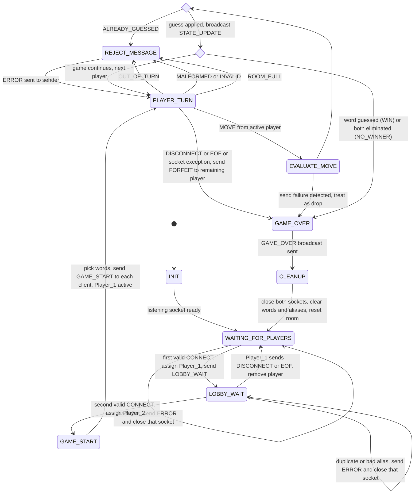

# Game FSM Specification: Two-Player Hangman Duel

This document specifies the **server-side** finite state machine. It must match `protocol_blueprint.md` exactly (message names, error codes, forfeit rules).

## 1. Rules Recap

- Exactly 2 players per room. The first valid `CONNECT` becomes **Player_1**, the second becomes **Player_2**.
- **Player_1 always moves first.** Turns then alternate, skipping any `ELIMINATED` player.
- Each player has their own secret word. A guess is checked against the **sender's** word.
- A wrong letter costs 1 of 5 guesses. A wrong word guess has no penalty. A correct word guess wins.
- The game ends on a correct word guess (`WIN`), when both players are eliminated (`NO_WINNER`), or when a player leaves (`FORFEIT`).

## 2. State Diagram

## 3. State Descriptions

| State | Entered when | Server actions |
|---|---|---|
| `INIT` | Server process starts | Bind and listen on TCP port. Create empty room (no players, no words). |
| `WAITING_FOR_PLAYERS` | After `INIT`, after `CLEANUP`, or when Player_1 leaves the lobby | Accept connections. Validate `CONNECT` alias (1-12 chars, letters/digits/underscore, unique). On the first valid `CONNECT`, assign Player_1, send `LOBBY_WAIT`, and move to `LOBBY_WAIT`. |
| `LOBBY_WAIT` | First valid `CONNECT` | Player_1 is registered and has been sent `LOBBY_WAIT`. Wait for a second valid `CONNECT`. If Player_1 leaves, return to `WAITING_FOR_PLAYERS` with no `GAME_OVER`. |
| `GAME_START` | Second valid `CONNECT` | Assign roles. Choose a secret word per player. Send `GAME_START` to each client separately (own `your_role`, `word_length`, `opponent_word_length`). |
| `PLAYER_TURN` | After `GAME_START`, after a continuing turn, or after `REJECT_MESSAGE` | Wait for a message from either socket. Only the active player's `MOVE` advances the game. |
| `REJECT_MESSAGE` | Out-of-turn `MOVE`, malformed or invalid message, third client, or repeated letter | Send `ERROR` to the sender only. Make no game state change and return to `PLAYER_TURN`. |
| `EVALUATE_MOVE` | Valid-looking `MOVE` from the active player | Check the guess against the sender's word. Update masked word, wrong letters, `wrong_remaining`, `status`. |
| `GAME_OVER` | Win, no winner, or forfeit | Send `GAME_OVER` (with `words` revealed) to every connected player. |
| `CLEANUP` | After `GAME_OVER` sent | Close both sockets, discard game data, reset the room. |
## 4. Edge Case Handling

### 4.1 Invalid and out-of-turn moves

An `ERROR` is sent **only to the sender**. Game state, active player, and guess counts do **not** change, and the receive loop keeps running (no crash, no disconnect).

| Situation | Check order | `ERROR` code | Next state |
|---|---|---|---|
| Not valid JSON, missing envelope field, wrong type, over 1024 bytes | 1 | `MALFORMED_MESSAGE` | `PLAYER_TURN` |
| `msg_type` not one of the 8 types | 2 | `UNKNOWN_MSG_TYPE` | `PLAYER_TURN` |
| `player_id` does not match the alias registered on that socket | 3 | `MALFORMED_MESSAGE` | `PLAYER_TURN` |
| Valid message at the wrong time (e.g., second `CONNECT`, `MOVE` in lobby) | 4 | `INVALID_STATE` | unchanged |
| `MOVE` from the non-active player | 5 | `OUT_OF_TURN` | `PLAYER_TURN` |
| Bad `guess_type`, letter not a-z, word not a-z or wrong length | 6 | `INVALID_GUESS` | `PLAYER_TURN` |
| Letter already guessed | 7 | `ALREADY_GUESSED` | `PLAYER_TURN` (same player, no penalty) |
| Third client connects | on `CONNECT` | `ROOM_FULL` (socket closed) | unchanged |

### 4.2 Disconnects

| Where it happens | Detection | Server response |
|---|---|---|
| `LOBBY_WAIT` (Player_1 only) | `DISCONNECT`, `recv()` returns `b""`, or exception | Remove player and return to `WAITING_FOR_PLAYERS`. No `GAME_OVER`. |
| `PLAYER_TURN` / `EVALUATE_MOVE`, either player, active or not | `DISCONNECT` message | `GAME_OVER` result `FORFEIT`, reason `OPPONENT_QUIT`, to the remaining player |
| Same | `recv()` returns `b""` (EOF) | `GAME_OVER` result `FORFEIT`, reason `OPPONENT_DROPPED` |
| Same | `ConnectionResetError`, `BrokenPipeError`, `ConnectionAbortedError`, `TimeoutError` | `GAME_OVER` result `FORFEIT`, reason `OPPONENT_DROPPED` |
| After `GAME_OVER` | any | Ignore and close the socket |

If the `GAME_OVER` send itself fails (the remaining player is also gone), catch the exception and continue to `CLEANUP`.

### 4.3 Post-game reset

`CLEANUP` closes both sockets, clears aliases, words, guesses, and active player, then returns to `WAITING_FOR_PLAYERS` so a new pair can play the next round.
